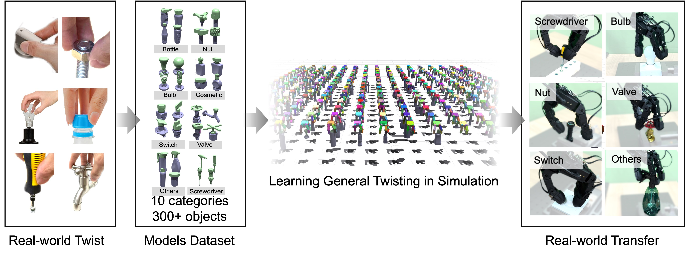

# DexAnyTwist: Learning General Dexterous Twisting with Hybrid Manipulation System Identification

> **Note:** This paper is currently under review. The full code and assets will be released upon acceptance.

[](https://opensource.org/licenses/MIT)
[](https://prevalenter.github.io/dexanytwist.github.io/)

**DexAnyTwist** is a general reinforcement learning framework for dexterous in-hand twisting manipulation. It addresses the challenge of hybrid manipulation dynamics by introducing a dynamic subsystem sample identification strategy. The framework is trained on a large-scale dataset of over 300 objects and achieves robust zero-shot sim-to-real transfer on diverse everyday objects using the GX10 dexterous hand.




## 🛠️ Installation

This project is built on **Isaac Gym** and **PyTorch**.

### Prerequisites
* Python 3.8+
* PyTorch 1.10+
* NVIDIA Driver & CUDA

### 1. Environment Setup
```bash
conda create -n dexanytwist python=3.8
conda activate dexanytwist
pip install torch torchvision torchaudio --extra-index-url [https://download.pytorch.org/whl/cu113](https://download.pytorch.org/whl/cu113)
```

### 2. Install Isaac Gym
Download the Isaac Gym Preview 4 from the [NVIDIA website](https://developer.nvidia.com/isaac-gym) and install it:

```bash
cd isaacgym/python
pip install -e .
```

## 📂 Dataset

We present a comprehensive library of twistable objects comprising over 300 instances across 10 distinct categories.

Categories: Bottle, Nut, Rotation Switch, Shampoo, Liquor, Bulb, Cosmetic, Valve, Screwdriver, etc.

Download: Please visit our [Project Page](https://prevalenter.github.io/dexanytwist.github.io/) to download the processed object assets.

Extract the dataset to the assets/ directory:

```bash
mkdir assets
# Unzip your downloaded data here
```

## 🏃 Usage

###  Train

To train the policy using the default configuration:
```bash
python train.py task=DexAnyTwist headless=True
```

###  Evaluate
and evaluate the policy
To evaluate the trained policy:
```bash
python train.py task=DexAnyTwist checkpoint=runs/DexAnyTwist/nn/DexAnyTwist.pth test=True
```


## 🙏 Acknowledgments

* We would like to thank the authors of [IsaacGymEnvs](https://github.com/NVIDIA-Omniverse/IsaacGymEnvs) as our codebase is built upon their excellent work.