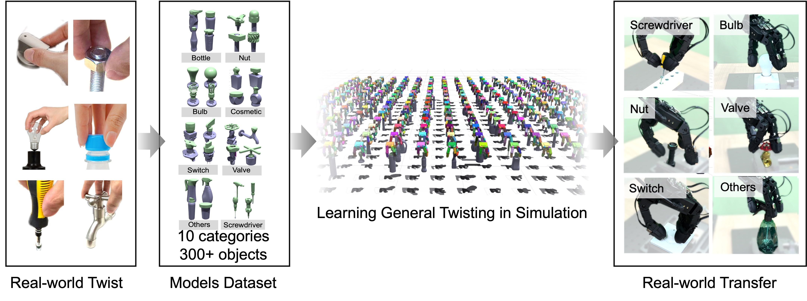

# DexAnyTwist: Learning General Dexterous Twisting with Hybrid Manipulation System Identification

[](https://opensource.org/licenses/MIT)
[](https://prevalenter.github.io/dexanytwist.github.io/)

> **Dataset Usage Example: This repository demonstrates how to download, organize, and run the DexAnyTwist dataset.**

**DexAnyTwist** is a general reinforcement learning framework for dexterous in-hand twisting manipulation. It addresses the challenge of hybrid manipulation dynamics by introducing a dynamic subsystem sample identification strategy. The framework is trained on a large-scale dataset of over 300 objects and achieves robust zero-shot sim-to-real transfer on diverse everyday objects using the GX10 dexterous hand.




## 🛠️ Installation

This project is built on **Isaac Gym** and **PyTorch**.

### Prerequisites
* Python 3.8+
* PyTorch 1.10+
* NVIDIA Driver & CUDA

### 1. Environment Setup
```bash
conda create -n dexanytwist python=3.8
conda activate dexanytwist
pip install torch torchvision torchaudio --extra-index-url [https://download.pytorch.org/whl/cu113](https://download.pytorch.org/whl/cu113)
```

### 2. Install Isaac Gym
Download the Isaac Gym Preview 4 from the [NVIDIA website](https://developer.nvidia.com/isaac-gym) and install it:

```bash
cd isaacgym/python
pip install -e .
```

## 📂 Dataset

We present a comprehensive library of twistable objects comprising over 300 instances across 10 distinct categories.

Categories: Bottle, Nut, Rotation Switch, Shampoo, Liquor, Bulb, Cosmetic, Valve, Screwdriver, etc.

Download the processed twist dataset from [Google Drive](https://drive.google.com/file/d/1h0-Z5Su4F436R_yXi9Rlr94a1lJH0XSU/view?usp=sharing).

Extract the dataset so that the final directory layout is:

```text
DexAnyTwist/
├── dexanytwist/
│   ├── assets/
│   │   ├── gx10/
│   │   └── twist_dataset/
│   │       └── twist_dataset_urdf/
│   └── isaacgymenvs/
└── README.md
```

The training code expects the object assets at `dexanytwist/assets/twist_dataset/twist_dataset_urdf/`. The GX10 hand assets are expected at `dexanytwist/assets/gx10/`.

## 🏃 Usage

###  Train

To train the policy using the default baseline configuration:

```bash
bash dexanytwist/isaacgymenvs/experiments/DexTwistAnything/reversion/baseline_huge.sh
```

For a small smoke test:

```bash
bash dexanytwist/isaacgymenvs/experiments/DexTwistAnything/reversion/baseline_huge.sh \
  num_envs=16 headless=True force_render=False max_iterations=1 \
  train.params.config.minibatch_size=128 \
  train.params.config.central_value_config.minibatch_size=128
```

###  Evaluate

To run metric evaluation with a trained checkpoint:

```bash
bash dexanytwist/isaacgymenvs/experiments/DexTwistAnything/reversion/baseline_huge.sh \
  --test_metric /path/to/checkpoint.pth
```


## 🙏 Acknowledgments

* We would like to thank the authors of [IsaacGymEnvs](https://github.com/NVIDIA-Omniverse/IsaacGymEnvs) as our codebase is built upon their excellent work.
* We also thank the [Democratizing Dexterous](https://github.com/Democratizing-Dexterous) project for providing inspiration for the hardware design.
